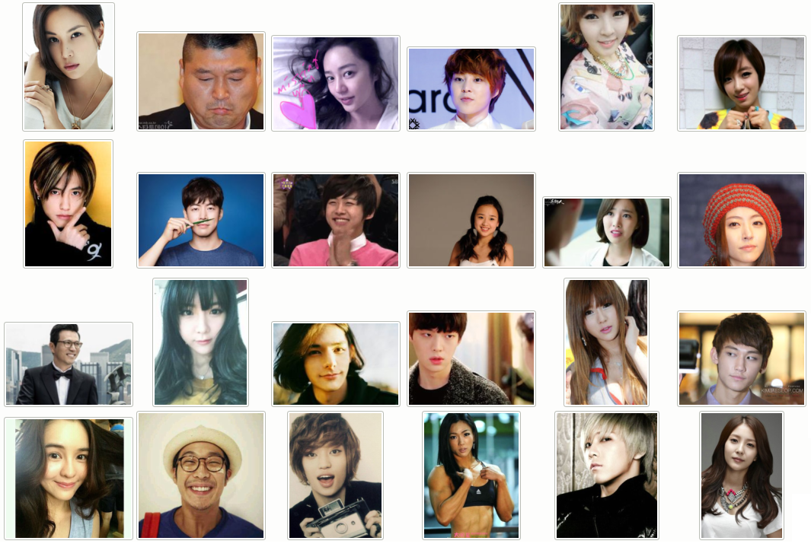
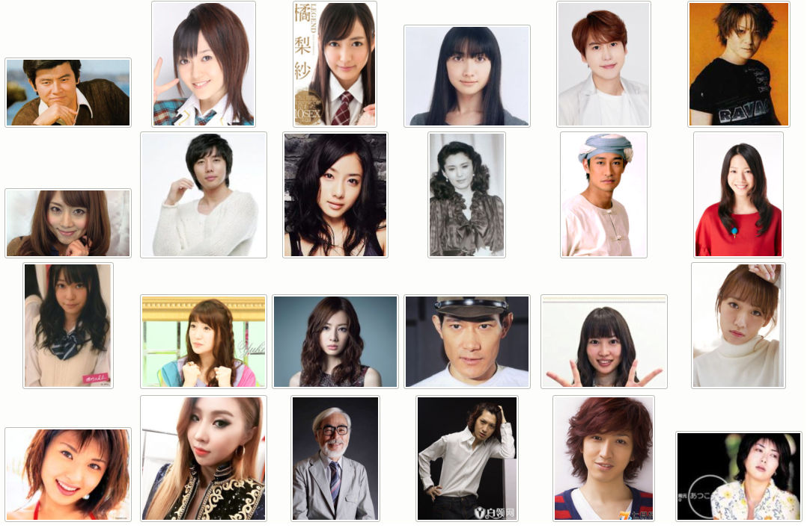

# Asian Celebrities Face Image Database

# Introduction 
* This repository is about the resource of a new Chinese Celibrites face images database.
* We gathered a face image dataset with 356.4K images of 7,676 Chinese celebrities crawled online automatically from versatile sources.
* It presents different sizes, various pose angles, a range of different light conditions, large age variations, etc.
* We also extended to collect a number famous people of Korea (552 subjects) and Japan (470 subjects) without cleaning.

[[report]](https://github.com/nz0001na/Asian_faces/blob/master/slides.pdf)

# Content
* Some face image samples of collected dataset
* code of a light image-cleaning tool.
      1. PyQt4:  python GUI
      2. DCleaning_tool:  a tool for cleaning images with target image
* a full name list of celebrities, including China, Korea, Japan.

# Some samples of Chinese Celebrities

# Korean Celebrities:

# Japanese Celebiries

